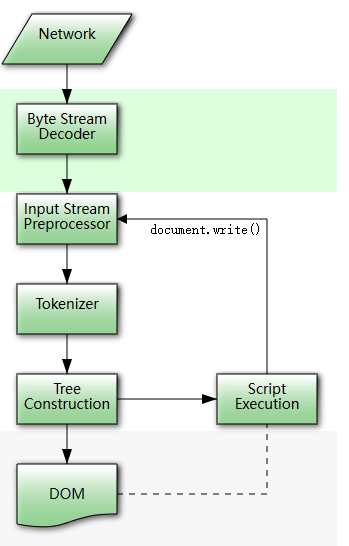

# HTML 解析的大致过程

# 先抄一张图

whatwg 的 html 文档中有关 html 解析过程的说明

## 粗线条的说明

- 网络响应传回 html 文件
- 浏览器将这些二进制字节流按照设定的 字符编码（character encoding） 方式来解码，最后形成实际的字符传给分词器
  - 其中似乎有一个字符编码嗅探算法，同时用字符编码和 confidence 值来判断是不是要更改编码方式
- 在进入分词器之前，这些字节流还需要进行一次预处理/标准化来替换其中一些字符
  - 比如 utf-lf 会替换所有的 utf-cr
  - utf null 会出于安全问题被替换为 utf fffd
- 标准化后的数据会进入分词阶段
  - 用大概 80 几个状态机来处理所有的 html 文本内容
  - 将连续的字节流拆分为一系列独立 tokne，并将配对好的 tokne 返回字节流
- 依据分词的 html 内容进行 tree construction
  - 这一阶段会和 document dom 相关联
  - 过程中会不断修改和扩充这个 dom 的内容
  - 最后返回这个完全体的 dom
- 最后结果是返回一个 document dom 对象
