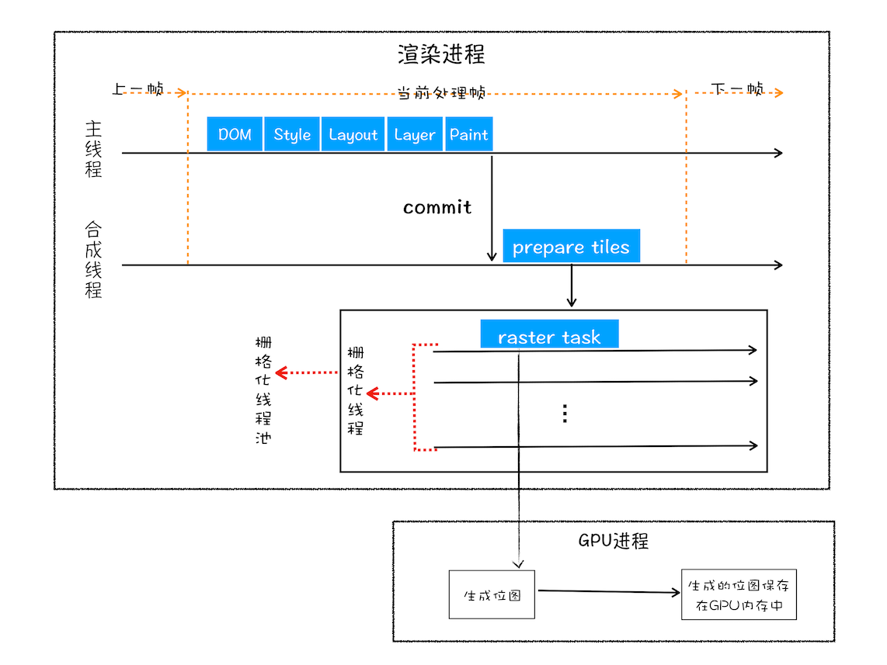

# 从 url 到页面

## 基本流程

### 客户端

- 构建请求
  - 浏览器进程基于 url 构建请求行信息，并转发给网络进程
  - 有一个 url 解析的过程
    - 直接输入 url 就会拼接上协议部分发送
    - 输入内容就会使用搜索引擎，然后合成为 url
  - 这时候还是 beforeunload 事件，还没有真正离开/更新页面
- 进程间通过 ipc 将请求发送到网络进程
  - 查找缓存，相当于整个请求过程中第一个拦截器
  - 请求 DNS 查找 ip 地址和端口
    - http 请求需要 tcp 连接作为环境
    - tcp 连接需要 ip 地址和端口号
    - ip 需要通过 url 向 DNS 查询
    - DNS 本身也有缓存
  - 如果是 https，则还要 tls
  - 首先等待 tcp 队列清空
    - chrome 中，同一个域名最多只能建立 6 个 tcp 连接，多的得等
    - 早些年的域名分片技术就是这么来的
  - 然后才开始建立 tcp 连接
    - 三次握手这些
  - 实际构建 http 报文，发送 http 请求

### 服务端

- 服务器返回请求
- 断开 tcp 连接或者保持长连接状态

### 再到客户端

请求收发阶段

- 网络进程获取响应数据，解析取出后交给浏览器进程
  - 观察是否有重定向，有就重新来一遍请求
  - 观察响应数据格式
    - 如果是 stream 一类的下载类型，则内容交给浏览器的下载管理其
    - 如果是普通 html，则浏览器继续导航流程，通知渲染进程准备开工

准备渲染阶段

- 浏览器进程检查新页面与现页面是否根域名相同
  - 相同则复用渲染进程
  - 不同则开启新的渲染进程

提交文档/开始更新

- 浏览器进程向渲染进程发送“提交导航 commitNavigation”消息
- 渲染进程收到消息后，与网络进程建立数据管道开始接收数据
- 渲染进程接收数据完毕就会向浏览器进程“确认提交”
- 浏览器进程收到确认提交后就移除旧文档，更新本进程中的页面状态
  - 地址栏 url
  - 历史状态
  - 更新页面

渲染阶段

- 由于网络请求依然正常收发 style 和 script 内容，所以这个过程中间可能会被嵌入不同的过程
  - 老题 js 阻塞解析
- 构建 DOM 树
  - 浏览器通过 dom 理解 html
- 样式计算，依然需要 css 样式表
  - 浏览器通过 styleSheets 理解 css
  - 将所有属性值标准化
  - 计算 dom 每个节点的样式
    - 适用继承和层叠规则
- 布局
  - 通过 dom 和 dom 中的元素样式结算 dom 中可见元素的几何位置
  - 构建布局树，只包含 dom 中的可见元素，head 里的都丢掉，display：none 的都丢掉
  - 动态计算并返回布局结果给布局树（我算我自己）
- 分层
  - 页面是有具体的不同图层的，是叠在一起的
  - 渲染引擎为特定节点生成专用图层，最后构建图层树
  - 布局树通过一些规则生成图层树
    - 有层叠上下文属性，比如 z-index，position，透明和滤镜
    - 需要裁剪 clip 的地方创建为图层
- 绘制(列表)
  - 对每个图层进行绘制
  - 渲染引擎将图层绘制分解为具体的绘制指令，并按顺序整合为一个待绘制列表
  - 绘制列表只是一个记录性质的文件，操作是由渲染引擎的合成线程完成的
- 分块
  - 主线程将绘制列表提交给合成线程
  - 合成线程将图层划分为不同的图块 tile（一般是 256*256 或者 512*512）
  - 视口附近的图块会优先生成位图 bitmap
  - 而生成位图 bitmap 的操作是栅格化来执行的
- 光栅化
  - 光栅化/栅格化就是图块转换为位图的过程
  - 图块是光栅化/栅格化的最小单位
  - 渲染进程维护了一个栅格化的线程池，负责所有的图块栅格化
  - GPU 进程可能加入栅格化的加速，生成的位图会保存再 GPU 内存中
  - 而如果栅格化确实使用 GPU，则最后整个流程就切换到 GPU 进程中完成
  - 
- 合成
  - 在所有图块的光栅化完成之后，合成线程就生成绘制图块的命令 DrawQuad，并提交给浏览器进程
  - 浏览器进程的 viz 组件会接收 DrawQuad 命令，并将页面内容绘制到内存中，最后将内存显示在屏幕上
  - 

## 特定步骤解释

- ip 把数据包送到目的主机
- tcp/udp 把数据包安全完整/送到目的应用程序

## 重排重绘合成与页面性能

重排 reflow 重新布局

- 更新元素的集合属性
- 即通过 js 或 css 修改元素的几何位置属性，如宽度、高度，就会触发重排
- 重排会触发布局以及之后的一系列操作，性能压力最大
- 

重绘 repaint

- 修改元素的颜色等纯粹的样式，只会触发绘制（列表）之后的操作
- 相比重排省掉浪费布局和分层
- 

合成

- transform 属性做的一些样式变化就只触发最后的合成操作，性能压力最小
- 
