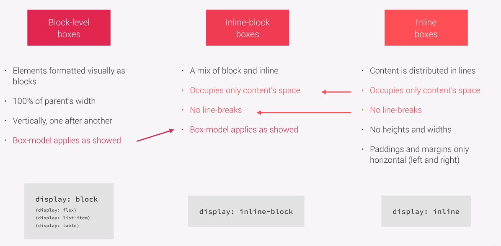

# 视觉格式化上下文

一套算法，用来计算盒以及渲染树种所有盒的布局，决定最终的页面布局

## 盒的维度/尺寸/dimension 盒模型

主要是盒模型的四个属性以及两种不同和模型

content-box 和 border-box 对于不同属性的加总/计算方式有所差异

## box type 页面上盒的不同类型 块，行 行内块

| 盒类型       | 占据空间     | 上下分布     | 宽高   | padding-margin |
| ------------ | ------------ | ------------ | ------ | -------------- |
| block        | 占满父级宽度 | 依次垂直分布 | 有     | 正常           |
| inline       | 只占 content | 无换行       | 无宽高 | 无垂直方向值   |
| inline-block | 只占 content | 无换行       | 有     | 正常           |

## positioning scheme 元素采取的浮动和定位

浮动影响周边元素
浮动的容器不会适应它的高度
绝对定位不影响周边元素
绝对定位通过手动指定来设置容器

## Stacking contexts 元素所处的堆叠上下文

这玩意视觉上理解起来很容易，但是看文档的设置也非常繁琐
暂时先记得 z-index 越大离人眼越近完事

## 渲染树中的其他元素

## 视口尺寸，图片尺寸等
