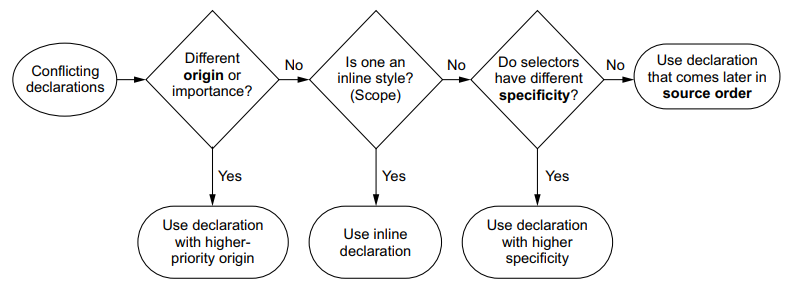

# 层叠与权重

## 权重规则按处理顺序依次为

样式来源提供的权重
specificity 计算规则提供的权重
代码顺序提供的权重
DOM 树继承的 style

## 样式来源提供的权重

是指浏览器自己也会设置一些默认样式，比如说 heading 类都"自动"加粗黑体，然后上下 margin 吧？list 都“自动”加左部原点和 padding 吧？
浏览器自己加的一般叫 user-agent style
我们写的叫 author style
有些浏览器还设置 user style，优先级最高
来源样式可以看 f12 自带结果，随便一动也就改了
我感觉来源样式基本也遵循代码先后规则，没有规定新的优先规则

!important 的优先级还是最高

## specificity 计算规则提供的权重

规则集里每一条规则都算数
内联 style 属性最高

不同级别的选择器相互组合之后又有不同的 specificity，ID,CLASS 和 Tag 三类 specificity 可以抽象为一个计算用的向量，每个种类的分值可叠加（四个数的向量是用来纳入行内 style 的）

- !important（被规则置为最高）>>>
- 行内样式>
- ID>
- 类，属性和伪类>
- 元素和伪元素 >>> \*（全局选择器被规则置为低于上述）>>>
- 继承（被规则置于最低）

因此从经验上讲

- 复杂选择器先在内部相加
- 高级别权重完全覆盖低级别权重
- 级别相同时，总体来说组合越复杂的选择权重越高
- 只有 ID,Class 和 Tag 有权重数值
- 选择器的组合符号不影响级别

所以手动改选择器权重的时候就想俩，一个升级就搞复杂一点，降级就搞简单一点

## 代码顺序提供的权重

## DOM 树继承的 style

沿 DOM 树继承
主要是 color，font 族，text 族，list 族，word，space，letter 等主要是行内属性，border-collapse 和 sapcing 也能继承
设置 inherit 可以手动盖过正常的优先级计算而继承父元素属性（但优先级相当低），也可以用于强制继承不默认继承的属性
设置 initial 可以手动恢复元素的默认值（基本都有），取消最后计算出来的属性值

## 权重规则经验总结

样式来源权重 > specifity > 代码先后顺序
少用 ID，少用! Important
简写属性可能会覆盖其他属性，要慎重，尤其是 font
粒度越小的权重越高，且大于关系是绝对的，n 个元素选择也比不上一个类选择
同权重属性则后出现的权重更高
元素嵌套后样式自动继承，优先级按由近到远实现
继承的唯一例外，background 的颜色可能覆盖 html（当未指定时）
