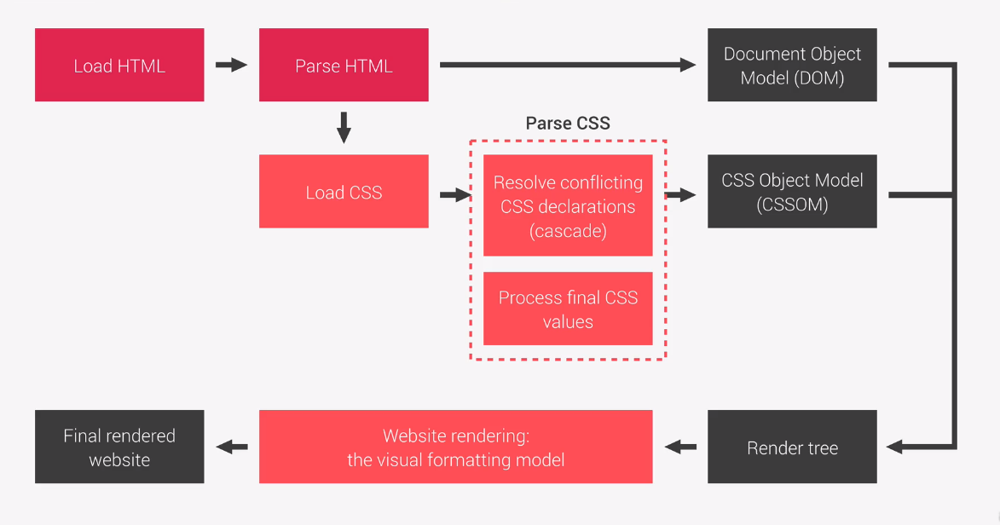

# css 在浏览器的解析过程（部分）

## 1 加载 html

## 2 解析 html

## 3 加载 css

## 3 形成 dom

### 解析有冲突的 css 声明

### 计算/处理最终的 css 值

[Value Resolve](public/valueResolve.png)

## 4 形成 cssom

## 5 dom 和 cssom 形成 render tree

## 6 浏览器形成 视觉格式化模型 visual formatting model

