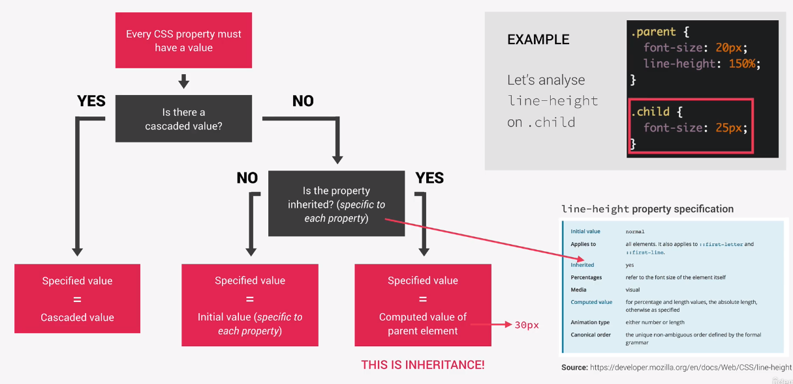

# css 值的继承

## 直观的思考

假如给 css 的规则画个可视化的示意图
那按理讲，图像整体应该有个从上到下流动的感觉，来反映继承
同时又要不断往最“下层”贴新样式来反映层叠
那整个图的感觉应该是天上有个倒立的金字塔，然后水（样式）一级一级往下流？
但人看的时候是从下到上一级一级往上看

## 基本规则

父元素样式被子元素继承，或者说父元素样式很可能被其包裹的子元素继承
但继承非常容易被覆盖，或者说优先级很低
不是所有属性都会被继承，被继承的集中在 text， font， line，letter 方面 \*全局选择是字面意思上选择所有元素，跟继承关系不大

## 继承的范围

有关 text 的属性基本都有继承
font-family， font-size，color 等
继承的值是计算值而非声明值
继承的前提是不明确设置值
继承可以手动指定

## 继承的来源确定

每个 css 属性都有值
1 来自层叠值吗？
2 如果来自层叠值，则层叠值等于设定值
2 如果不来自层叠值，则进一步算是否来自可继承的属性
3 如果是，则设定值等于父元素的计算值 这也就是继承
3 如果不是，则直接使用初始值

