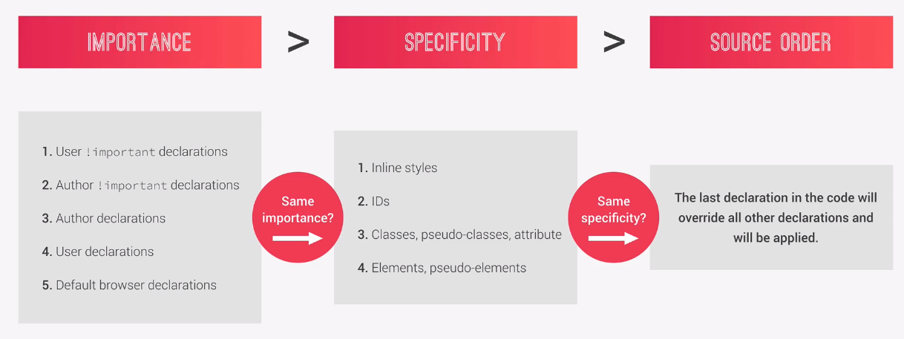

# css 选择器

# 选择器顺序图解

# 选择器的基本思路

元素本身
手动对元素分类/包括 id 和 class
根据元素属性选择
:状态选择 伪类选择 ，不如叫扩展类，只是扩充了一些常见状态
重要状态之外
元素中第 n 个
元素中某类的第 n 个
（还包括倒数第 n 个）
::伪元素 也可以叫扩展元素嗷，就是对选中元素做更细致的调整，里面还有选中首字符，一看就是首行锁进大小写啥的
:root 伪类选择器等价于 html 的 tag 选择器

# 选择器的结合方式有一些基本思路

分组选择，同时选中一群不一样的元素使用一套样式
多条件选择，使一个元素能适应不同的样式选择
关系选择 考虑纵向的代际代数，和横向的亲缘广度

- （纵向 n 代）后代选择 空格，在空格前选择器的范围中筛选空格后选择器
- （纵向 1 代）父子选择 >
- （横向下 1 个）兄弟姐妹选择 +
- （横向下 n 个）通用兄弟选择 ~
- （父子选择迂回处理，基本上是手动指定兄 class）向上反选哥哥

# 继承沿着 DOM 实现，所以渲染顺序跟这个肯定也有关系
